<h1 align="center">Yukisato Nakata</h1>

  

  
  

  
  
  
  
  
  
  
  
  
  

  機械学習/個人開発をしています · 深層学習 / 論文実装 · VS&nbsp;Code&nbsp;+&nbsp;uv

 

<!--
  Generated inside GitHub Actions by lowlighter/metrics and committed daily,
  so private-repo activity is included (no external hosting).
  Placeholder images are shown until the first Actions run succeeds.
-->

  

  

 

<!-- Animated contribution activity graph (public contributions) -->

  

